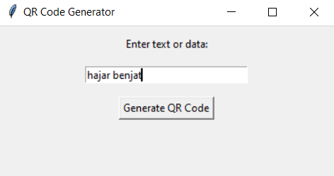

# QR Code Generator
A simple Python application to generate QR codes from text or data input.

## Description
QR Code Generator is a simple Python application that allows you to generate QR codes for different types of data and save them as PNG files.

## Features
- Generate QR codes for text, URLs, contact information, etc.
- Save QR codes as PNG files.
- Simple and easy-to-use GUI interface.

## Requirements
- Python 3.6 or higher
- `qrcode` library: You can install it using `pip install qrcode`
- `tkinter` library (usually comes pre-installed with Python)
- `pyinstaller` library (optional for creating standalone executable): You can install it using `pip install pyinstaller`

## How to Use
1. Make sure you have Python and the required libraries installed.
2. Run the `QRGenerator.py` script.
3. Enter the text or data for which you want to generate a QR code in the entry box.
4. Click on the "Generate QR Code" button.
5. Choose a location and filename to save the generated QR code as a PNG file.

## Building Standalone Executable
If you want to create a standalone executable without the console window, you can use `pyinstaller`:

1. Install `pyinstaller` using `pip install pyinstaller` if you haven't already.
2. Open a terminal or command prompt in the directory containing `QRGenerator.py`.
3. Run the command: `pyinstaller --noconsole QRGenerator.py`
4. The standalone executable will be created in the `dist` directory.

## Screenshots

## License
This project is licensed under the [MIT License](LICENSE).

## Author
HAJAR BENJAT
